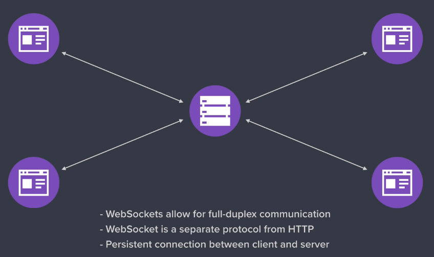

# CursoNode

## First - Notes app

* Simple r and w over the fs using node and a overview over debugging an app
* Creation of command line app with arguments

### To start debug mode.
```node inspect app.js```
 
```nodemon inspect app.js```

``` 
 * In debug mode press:
 * "c" continue
 * "n" go to next line
 * "repl" start console like Chrome Dev Tool

 * In the code we can add breakpoint by typing "debugger;"
```
#### Using Chrome Debug tools
```nodemon --inspect-brk app.js```
Then go to ```chrome://inspect``` and open the "Open dedicated DevTools for Node"

### arraow functions and methods on objects (playground)


## Second - Consume api and serve content

### Web Server
    * http://expressjs.com/
    * web server from public folder. serving content of it.
    * middleware express: they are set using express method use() and are excecuted in sequenzial order unless one of then do not call next() callback.
    * view engien and more methods from express applications.
    * helpers hbs , partials and templates
    * Caching responses.
    * Consume api from node app using axios and https. (NASA)

## Third - API + MongoDB + security

### API
    * express routers

### MongoDB
    * mongoose
        - schemas
        - middleware
        - methods + statics for models
        - submodels
        - refs and virtual (schemas)
        - query ( populate('field').execPopulate() )

### Security + API Authtentication
    * save passwords with __bcryptjs__
        - hash vs encrypt: In the first one, the value of the hash cannot be obtained and the encryption is reversible
    * JWT Authtentication with __jsonwebtoken__
        - the meaning of this is to give the client a way to auth to the api, the way would be a token created with the method `sign` that has a expiretion date that also contains information about the user that could be easily check by the back with the `verify` method.
    * middleware to single routes.

    * Investigate [pasport](http://www.passportjs.org/) - seems to be a good option for auth.

### File Uploading with __multer__ and __sharp__ to resize and convert
    * type filters.
    * size limits.
    * conver to png.
    * resize file.

### Send emails through https://sendgrid.com/
    * sign up email.
    * delete account email.

### Production MongoDB through Atlas https://www.mongodb.com/

### Automated Testing (Why tests?)
    * Saves time
    * Creates reliable code
    * Gives flexibility to devs:
        - refactoring
        - collaborating
        - profiling
    * Peace of mind

    - Async test
    - mock libraries

## Fourth - Chat + Socket.io

### Websocket protocol



### Error handling middleware
    
    * https://codeburst.io/better-error-handling-in-express-js-b118fc29e9c7

# Nice to have: 
    
    * Event Emitters
    * Buffers
    * Streams
    * Typescript